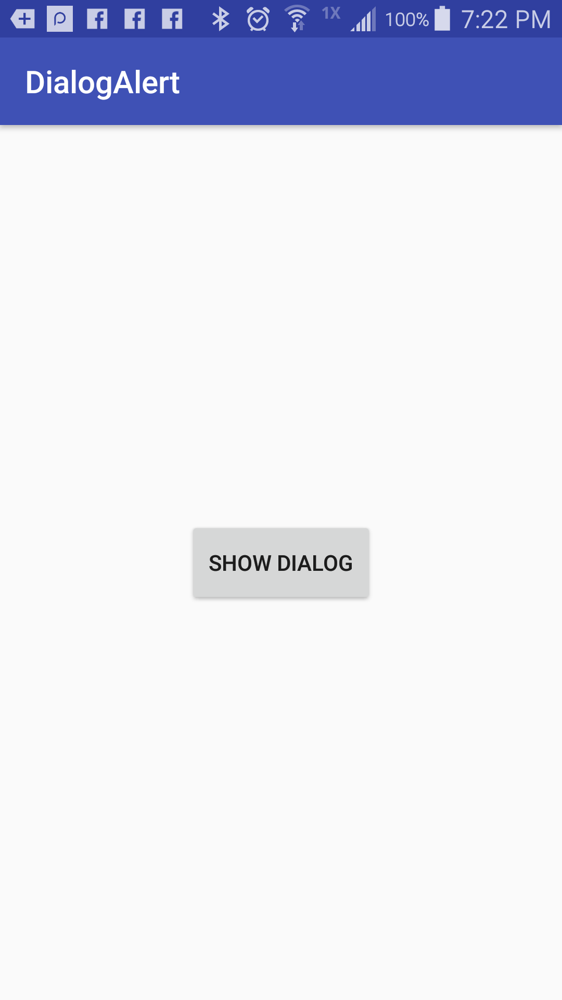
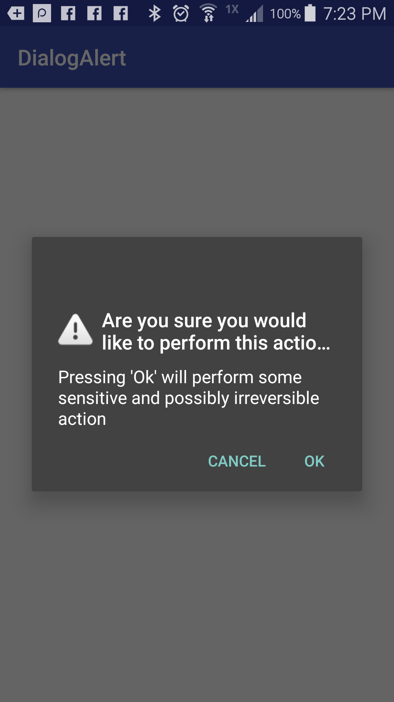

# Android-DefaultDialogAlert
Quick example showcasing the defaul dialog popup alert. Useful for prompting user to decide between performing some sensitive action and cancelling such as logging out of their account or deleting some content

 
 

